# SLEAP-RTC System Architecture

**Last Updated:** 2025-11-11
**Status:** Proposed Architecture with Room-Level Model Registry

---

## High-Level System Architecture


---

## Component Descriptions

### User Environment

**Client CLI** (`sleap_rtc/cli.py`)
- Command-line interface for training, inference, model management
- Authenticates with Cognito (ephemeral accounts)
- Connects to signaling server via WebSocket
- Queries/updates room-level model manifest in S3
- Establishes WebRTC data channels with workers for training/inference

**Web UI** (`sleap_rtc/client/registry_server.py`)
- Web-based model registry viewer
- Displays room-level model manifest
- Shows worker availability and status
- Real-time updates via WebSocket or periodic polling

### AWS Infrastructure

**Signaling Server** (`webRTC-connect/webRTC_external/server.py`)
- **Technology:** FastAPI + WebSockets
- **Hosting:** EC2 instance (deployed via Terraform)
- **Purpose:** Peer discovery, message routing, room management
- **Key Features:**
  - WebSocket message handling (register, discover_peers, peer_message, offer/answer, candidate)
  - Peer-to-peer message routing without RTC connection
  - Metadata-based peer discovery (filter by role, tags, properties)
  - No database backing (in-memory state with S3 backup)

**AWS Cognito**
- **Purpose:** Authentication for users and workers
- **Type:** Ephemeral accounts (like Excalidraw - no persistent user accounts)
- **Token-based:** JWT tokens for WebSocket authentication
- **API:** `/anonymous-signin` endpoint generates temporary credentials

**DynamoDB**
- **Table:** `rooms`
- **Purpose:** Persistent room metadata storage
- **TTL:** 2 hours
- **Fields:** room_id, token, created_at, expires_at

**S3 Buckets**
- **S3State:** Signaling server state backup
- **S3RoomModels:** Room-level model registry + model files
  - Structure: `s3://sleap-rtc-rooms/{room_id}/manifest.json`
  - Model files: `s3://sleap-rtc-rooms/{room_id}/models/{model_id}/`

### RunAI / Kubernetes Cluster

**SLEAP-RTC Workers**
- **Deployment:** RunAI workspaces (Kubernetes pods)
- **Packages:** sleap-rtc + sleap-nn
- **Storage:** Ephemeral (no persistent volumes assumed)
- **Local Model Cache:** Downloaded models cached in pod filesystem
- **GPU Access:** Direct access to GPU for training/inference

**Worker Lifecycle:**
1. Start RunAI workspace
2. Authenticate with Cognito
3. Register with signaling server (role: 'worker')
4. Query room manifest from S3
5. Accept job requests via peer messages
6. Download models from S3 as needed
7. Execute training/inference on GPU
8. Publish trained models back to S3 room manifest

### Network Infrastructure

**STUN Server**
- NAT discovery for WebRTC connections
- Helps peers determine their public IP addresses

**TURN Server**
- Relay server for WebRTC traffic when direct P2P fails
- Required when NAT traversal fails

---

## Room-Level Model Manifest Architecture

### Manifest Storage Location

```
S3 Bucket: sleap-rtc-rooms
Structure:
├── {room_id}/
│   ├── manifest.json          # Room-level model registry
│   └── models/
│       ├── {model_id_1}/
│       │   ├── best.ckpt
│       │   ├── training_config.json
│       │   └── initial_config.json
│       ├── {model_id_2}/
│       │   └── ...
│       └── ...
```

### Manifest Schema

```json
{
  "version": "1.0",
  "room_id": "lab-mice-2025",
  "updated_at": "2025-11-11T12:00:00Z",
  "models": {
    "a3f5e8c9": {
      "id": "a3f5e8c9",
      "alias": "production-v2",
      "model_type": "centroid",
      "trained_at": "2025-11-11T10:00:00Z",
      "trained_by": "user-123",
      "trained_on_worker": "worker-gpu-01",
      "s3_path": "s3://sleap-rtc-rooms/lab-mice-2025/models/a3f5e8c9/",
      "checkpoint_path": "s3://sleap-rtc-rooms/lab-mice-2025/models/a3f5e8c9/best.ckpt",
      "size_bytes": 8388608,
      "available_on_workers": ["worker-gpu-01", "worker-gpu-03"],
      "notes": "Production model validated on 2025-11-10",
      "tags": ["validated", "production", "v2.0"],
      "training": {
        "dataset_hash": "d7f3a1b2",
        "epochs": 100,
        "final_loss": 0.023,
        "training_duration_sec": 3600
      }
    }
  },
  "aliases": {
    "production-v2": "a3f5e8c9",
    "latest-centroid": "a3f5e8c9"
  }
}
```

### Access Patterns

**Clients:**
- Query manifest from S3 to see available models
- Resolve model alias → download from S3 if needed → send to worker via WebRTC
- OR send model reference (ID/alias) to worker via peer_message, worker downloads from S3

**Workers:**
- Query manifest from S3 on startup (cache locally)
- Download models from S3 as needed (cache in local filesystem)
- After training completes: upload model to S3 + update manifest
- Periodically refresh manifest from S3 (every 5 minutes)

### Consistency Strategy

**Problem:** Multiple workers updating manifest simultaneously

**Solution Options:**

1. **Optimistic Locking with ETags**
   - Read manifest with ETag
   - Update manifest with If-Match header
   - Retry on conflict

2. **Lambda-based Manifest Updates**
   - Workers send update request to Lambda
   - Lambda serializes updates
   - Single source of truth

3. **Event-driven Updates**
   - Workers publish "model_trained" event to SNS/SQS
   - Lambda processes events sequentially
   - Updates manifest atomically

**Recommended:** Option 1 (Optimistic Locking) for simplicity

---

## Key Communication Patterns

### 1. Model Resolution Flow (Proposed)

```mermaid
sequenceDiagram
    participant Client
    participant S3 as S3 Room Manifest
    participant SignalingSrv as Signaling Server
    participant Worker

    Client->>S3: Query manifest for room
    S3-->>Client: Return manifest.json
    Client->>Client: Resolve alias "production-v2" → model ID "a3f5e8c9"
    Client->>SignalingSrv: peer_message: registry_query<br/>(check if worker has model a3f5e8c9)
    SignalingSrv->>Worker: Forward peer_message
    Worker->>Worker: Check local cache
    Worker->>SignalingSrv: peer_message: registry_response<br/>(has_model: true)
    SignalingSrv->>Client: Forward peer_message

    alt Worker has model locally
        Client->>Worker: WebRTC: Start inference with model a3f5e8c9
    else Worker needs to download
        Worker->>S3: Download model a3f5e8c9
        S3-->>Worker: Model files
        Worker->>Worker: Cache locally
        Client->>Worker: WebRTC: Start inference with model a3f5e8c9
    end
```



### 2. Training Workflow with Room Manifest


### 3. Peer Discovery for Worker Selection


---

## Data Flow Summary

### Model Registry Data Flow

1. **Model Creation (Training):**
   - Worker trains model → generates model ID
   - Worker uploads model files to S3: `s3://sleap-rtc-rooms/{room_id}/models/{model_id}/`
   - Worker updates room manifest in S3
   - Other clients/workers can now discover this model

2. **Model Discovery:**
   - Client queries room manifest from S3
   - Client sees all available models in room
   - Client can filter by alias, tags, model_type, etc.

3. **Model Usage (Inference):**
   - Client resolves alias → model ID via manifest
   - Client checks if worker has model (peer_message query via signaling server)
   - Worker downloads model from S3 if needed (caches locally)
   - Client sends inference request with model reference
   - Worker uses cached model for inference

4. **Model Sharing:**
   - User A trains model → published to room manifest
   - User B queries room manifest → sees User A's model
   - User B uses model for inference on any available worker
   - Worker downloads model from S3 first time, caches for subsequent uses

### WebRTC Data Channel Usage

**Large Data Transfers (via WebRTC):**
- Training datasets (Client → Worker)
- Inference results (Worker → Client)
- Progress updates during training
- Video frames for real-time inference

**Small Messages (via Signaling Server peer_message):**
- Job requests/responses
- Registry queries
- Status updates
- Worker availability checks

---

## Deployment Considerations

### RunAI Worker Pods

**Requirements:**
- Network access to:
  - AWS Cognito (authentication)
  - Signaling server EC2 instance (WebSocket)
  - S3 buckets (model storage)
  - STUN/TURN servers (WebRTC)
- GPU access via RunAI
- Python environment with sleap-rtc + sleap-nn

**Storage:**
- **Assumption:** Ephemeral pods (no persistent volumes)
- **Implication:** Workers must download models from S3 each time pod starts
- **Optimization:** Consider adding persistent volume claim for model cache

### Signaling Server

**Current:**
- Stateless (in-memory state with S3 backup)
- Single EC2 instance

**Scaling Considerations:**
- Add Redis for shared state across multiple instances
- Use ALB for load balancing
- Add health checks and auto-recovery

### S3 Room Manifest

**Concurrency:**
- Multiple workers may update manifest simultaneously
- Use optimistic locking (ETags) or Lambda-based updates

**Performance:**
- Manifest queries are frequent
- Consider caching manifest in Redis with 5-minute TTL
- Clients/workers cache manifest locally with periodic refresh

---

## Security Considerations

1. **Authentication:** Cognito-based ephemeral accounts (current)
2. **S3 Access:** Workers need IAM role with read/write to room bucket
3. **Room Isolation:** Manifests partitioned by room_id (current)
4. **Model Access Control:** Currently none - any worker in room can access any model
   - **Future:** Add model-level permissions

---

## Open Questions for Implementation

1. **S3 Bucket Naming:** What's the bucket name for room models?
2. **IAM Roles:** How do RunAI workers authenticate to S3?
3. **Manifest Locking:** Optimistic locking vs Lambda-based updates?
4. **Model Cleanup:** When do we delete old models from S3?
5. **Room Lifecycle:** What happens to manifest when room expires (2hr TTL)?
6. **Cache Strategy:** Should workers use persistent volumes for model cache?

---

## Next Steps

1. ✅ Create architecture diagram (this document)
2. ⏳ **Decision:** Approve room-level manifest architecture
3. ⏳ **Decision:** Choose manifest locking strategy
4. ⏳ Update task list (`tasks.md`) to reflect room-level manifest
5. ⏳ Implement room manifest storage and access patterns
6. ⏳ Modify Steps 6-11 to use room manifest instead of local registries
7. ⏳ Add S3 integration for model upload/download
8. ⏳ Test with RunAI workers in Kubernetes
