# Comprehensive Architecture: Cost-Effective Worker Model Management

This diagram shows how the hybrid transport architecture addresses:
1. Model caching (ephemeral, shared, persistent)
2. Model specification after training (aliases and tags)
3. Registry-like tags (in room manifest)
4. Immediate result delivery (WebRTC + S3 + Torrent)

---

## System Architecture with All Four Capabilities

```mermaid
graph TB
    subgraph "User Environment"
        User[👤 User/Researcher]
        Client[💻 SLEAP-RTC Client]
    end

    subgraph "Control Plane - WebRTC"
        Signaling[📡 Signaling Server<br/>EC2 WebSocket]
        WebRTC1[🔗 WebRTC Channel 1<br/>Client ↔ RunAI Worker]
        WebRTC2[🔗 WebRTC Channel 2<br/>Client ↔ Desktop Worker]
    end

    subgraph "Data Plane - S3 Storage"
        S3Upload[📦 S3: Temp Uploads<br/>24hr TTL]
        S3Room[📦 S3: Room Storage<br/>Persistent]

        subgraph "Room: lab-mice-2025"
            Manifest["📋 manifest.json<br/>(~50 KB)<br/>━━━━━━━━━━━━━━━━<br/>Models Registry:<br/>• a3f5e8c9 → alias: prod-v2<br/>• Tags: validated, baseline<br/>• Availability: S3, Torrent<br/>• Cached on: desktop-01"]
            ModelFiles["📁 models/<br/>━━━━━━━━━━━━━━━━<br/>centroid_a3f5e8c9/<br/>  ├─ best.ckpt (500MB)<br/>  ├─ config.json<br/>topdown_b4f6d2e1/<br/>  └─ ..."]
        end
    end

    subgraph "RunAI Kubernetes Cluster"
        subgraph "RunAI Worker Pod 1"
            RWorker1[⚙️ Worker Process]
            RCache1["💾 Cache<br/>━━━━━━━━━━━━━<br/>Option A: Ephemeral<br/>/tmp/sleap-cache/<br/>(dies with pod)<br/>━━━━━━━━━━━━━<br/>Option B: Shared PVC<br/>/shared-cache/<br/>(persistent)"]
            RGPU1[🎮 GPU]
        end

        subgraph "RunAI Worker Pod 2"
            RWorker2[⚙️ Worker Process]
            RCache2["💾 Cache<br/>(shared or ephemeral)"]
            RGPU2[🎮 GPU]
        end
    end

    subgraph "Desktop/Lab Infrastructure"
        subgraph "Desktop Worker 1"
            DWorker1[⚙️ Worker Process]
            DCache1["💾 Persistent Cache<br/>━━━━━━━━━━━━━━━━<br/>~/.sleap-rtc/cache/<br/>• Survives restarts<br/>• Can serve P2P<br/>• Torrent seeding"]
            DGPU1[🎮 GPU]
            Torrent1[🌱 Torrent Seeder]
        end

        subgraph "Desktop Worker 2"
            DWorker2[⚙️ Worker Process]
            DCache2["💾 Persistent Cache"]
            DGPU2[🎮 GPU]
            Torrent2[🌱 Torrent Seeder]
        end
    end

    subgraph "P2P Network"
        TorrentDHT["🌐 Torrent DHT<br/>Model Discovery<br/>━━━━━━━━━━━━━<br/>Model a3f5e8c9:<br/>Seeders: 2 online"]
    end

    %% User interactions
    User -->|1. Submit Training Job| Client

    %% Client upload dataset
    Client -->|2. Upload Dataset<br/>Multipart 5GB| S3Upload

    %% Client submits job via signaling
    Client -->|3. Job Request<br/>peer_message<br/>{dataset: s3://...}| Signaling
    Signaling -->|Route to available| RWorker1

    %% WebRTC connection for progress
    Client <-->|4. WebRTC Progress<br/>Real-time updates| WebRTC1
    WebRTC1 <--> RWorker1

    %% Worker downloads dataset
    RWorker1 -->|5. Download Dataset| S3Upload

    %% Worker trains
    RWorker1 -->|6. Train| RGPU1

    %% CAPABILITY 4: Immediate results via WebRTC
    RWorker1 -.->|7a. Immediate Results<br/>WebRTC DataChannel<br/>━━━━━━━━━━━━━━━<br/>• Job complete notification<br/>• model_id + alias<br/>• Final metrics<br/>• Sample predictions<br/>• Thumbnails| WebRTC1

    %% CAPABILITY 4: Upload full model to S3 (parallel)
    RWorker1 -->|7b. Upload Model<br/>Parallel with 7a| ModelFiles

    %% CAPABILITY 2 & 3: Update manifest with alias and tags
    RWorker1 -->|8. Update Manifest<br/>━━━━━━━━━━━━━━━━<br/>Add model entry:<br/>• alias: prod-v2<br/>• tags: validated<br/>• S3 path<br/>• training metrics<br/>Optimistic locking| Manifest

    %% CAPABILITY 1: Cache check
    RWorker2 -->|9. Need Model?<br/>Check cache first| RCache2
    RCache2 -.->|Cache miss| RWorker2

    %% Query manifest
    RWorker2 -->|10. Query Manifest<br/>GET manifest.json| Manifest

    %% Download strategies
    RWorker2 -->|11a. Try Torrent<br/>If seeders available| TorrentDHT
    TorrentDHT -->|Discover seeders| Torrent1
    Torrent1 -.->|11b. P2P Download<br/>FREE bandwidth| RWorker2

    RWorker2 -->|11c. Fallback to S3<br/>If torrent fails| ModelFiles

    %% Cache the model
    RWorker2 -->|12. Cache Model<br/>For future use| RCache2

    %% Desktop worker caching
    DWorker1 -->|Train/Download Model| DCache1
    DCache1 -->|13. Seed via Torrent<br/>FREE CDN| Torrent1
    Torrent1 -->|Announce| TorrentDHT

    %% Desktop worker updates manifest availability
    DWorker1 -->|14. Advertise in Manifest<br/>cached_on_workers:<br/>desktop-gpu-01| Manifest

    %% Manifest connections to other components
    Manifest -.->|Points to| ModelFiles
    Manifest -.->|Tracks| TorrentDHT

    %% Client queries manifest
    Client -->|15. Query Models<br/>GET manifest.json<br/>Resolve alias → model_id| Manifest

    %% Styling
    classDef userStyle fill:#e1f5ff,stroke:#0066cc,stroke-width:2px
    classDef controlStyle fill:#fff3e0,stroke:#ff9800,stroke-width:2px
    classDef storageStyle fill:#e8f5e9,stroke:#4caf50,stroke-width:2px
    classDef runaiStyle fill:#f3e5f5,stroke:#9c27b0,stroke-width:2px
    classDef desktopStyle fill:#fce4ec,stroke:#e91e63,stroke-width:2px
    classDef p2pStyle fill:#fff9c4,stroke:#fbc02d,stroke-width:2px
    classDef manifestStyle fill:#b3e5fc,stroke:#0277bd,stroke-width:3px

    class User,Client userStyle
    class Signaling,WebRTC1,WebRTC2 controlStyle
    class S3Upload,S3Room,ModelFiles storageStyle
    class RWorker1,RWorker2,RCache1,RCache2,RGPU1,RGPU2 runaiStyle
    class DWorker1,DWorker2,DCache1,DCache2,DGPU1,DGPU2,Torrent1,Torrent2 desktopStyle
    class TorrentDHT p2pStyle
    class Manifest manifestStyle
```

---

## Training Workflow Sequence (Four Capabilities Highlighted)

```mermaid
sequenceDiagram
    participant Client
    participant S3Temp as S3 Temp Uploads
    participant Signaling as Signaling Server
    participant Worker as RunAI Worker
    participant GPU
    participant Manifest as Room Manifest
    participant S3Room as S3 Room Storage
    participant WebRTC as WebRTC Channel

    Note over Client,WebRTC: 📤 PHASE 1: Dataset Upload (S3 Multipart)

    Client->>Client: Large dataset (5 GB)
    Client->>S3Temp: Request upload URLs<br/>(multipart 100MB chunks)
    S3Temp-->>Client: Presigned URLs (50 parts)
    Client->>S3Temp: Upload parts 1-50<br/>(parallel, resumable)
    S3Temp-->>Client: Upload complete<br/>s3://uploads/dataset123

    Note over Client,WebRTC: 🎯 PHASE 2: Job Submission (Signaling)

    Client->>Signaling: peer_message: job_request<br/>{<br/>  dataset: {type: "s3", path: "s3://..."},<br/>  config: {...},<br/>  requested_alias: "prod-v2",<br/>  tags: ["baseline", "validated"]<br/>}
    Signaling->>Worker: Forward job request

    Note over Client,WebRTC: 🔗 PHASE 3: WebRTC Connection (Progress)

    Worker->>Client: Establish WebRTC DataChannel
    activate WebRTC
    WebRTC-->>Client: Connected ✅

    Note over Client,WebRTC: 💾 PHASE 4: Model Download (CAPABILITY 1: Caching)

    Worker->>Worker: Check local cache:<br/>Need centroid model for training?

    alt Model in cache
        Worker->>Worker: ✅ Use cached model<br/>(session cache or shared PVC)
    else Model not in cache
        Worker->>Manifest: GET manifest.json<br/>Query for centroid model
        Manifest-->>Worker: Model info:<br/>{s3_path, torrent, cached_on}

        alt Torrent seeders available
            Worker->>Worker: Try P2P download
            Note over Worker: 🌱 Download from desktop seeders (FREE)
        else Fallback to S3
            Worker->>S3Room: Download model from S3
            S3Room-->>Worker: Model files (500 MB)
        end

        Worker->>Worker: 💾 Save to cache<br/>(for future jobs)
    end

    Note over Client,WebRTC: 🚂 PHASE 5: Training with Progress

    Worker->>S3Temp: Download training dataset
    S3Temp-->>Worker: Dataset (5 GB)
    Worker->>GPU: Start training

    loop Every epoch
        GPU-->>Worker: Epoch complete + metrics
        Worker->>WebRTC: Progress update<br/>{epoch: N, loss: X, val_loss: Y}
        WebRTC-->>Client: Live progress ⚡
        Client->>Client: Display to user<br/>Real-time charts
    end

    GPU-->>Worker: Training complete!

    Note over Client,WebRTC: 📨 PHASE 6: Immediate Results (CAPABILITY 4)

    Worker->>Worker: Generate model_id from config<br/>model_id: "a3f5e8c9"

    par Immediate delivery via WebRTC
        Worker->>WebRTC: 🚀 Instant notification<br/>{<br/>  type: "training_complete",<br/>  model_id: "a3f5e8c9",<br/>  alias: "prod-v2",<br/>  metrics: {final_loss, val_loss},<br/>  sample_predictions: [...],<br/>  thumbnails: [base64...]<br/>}
        WebRTC-->>Client: Received < 100ms ⚡
        Client->>Client: 🎉 Show user:<br/>• Training complete!<br/>• Display samples<br/>• Show metrics
    and Upload full model to S3 (parallel)
        Worker->>S3Room: Upload model files<br/>s3://room/models/a3f5e8c9/<br/>(500 MB, takes 30 sec)
        S3Room-->>Worker: Upload complete ✅
    end

    Note over Client,WebRTC: 🏷️ PHASE 7: Manifest Update (CAPABILITIES 2 & 3)

    Worker->>Manifest: GET manifest.json (with ETag)
    Manifest-->>Worker: Current manifest + ETag: "v1"

    Worker->>Worker: Add model entry:<br/>{<br/>  id: "a3f5e8c9",<br/>  alias: "prod-v2", ✨ CAPABILITY 2<br/>  tags: ["validated", "baseline"], ✨ CAPABILITY 3<br/>  s3_path: "s3://...",<br/>  trained_by: "user@lab.edu",<br/>  metrics: {...}<br/>}

    Worker->>Manifest: PUT manifest.json<br/>(If-Match: "v1")<br/>Optimistic locking

    alt Update successful
        Manifest-->>Worker: 200 OK, ETag: "v2"
        Worker->>WebRTC: Final notification<br/>{status: "published"}
        WebRTC-->>Client: Model available! ✅
    else Conflict (another worker updated)
        Manifest-->>Worker: 412 Conflict
        Worker->>Worker: Retry with fresh ETag
    end

    deactivate WebRTC

    Note over Client,WebRTC: ✅ User can now use model by alias "prod-v2"
```



---

## Model Download Strategy (Capability 1: Smart Caching)

```mermaid
flowchart TD
    Start([Worker needs model_id: a3f5e8c9])

    CheckCache{Check local cache}
    CacheHit[✅ Use cached model<br/>Instant, FREE]

    CacheMiss[❌ Cache miss<br/>Need to download]

    QueryManifest[Query room manifest<br/>GET manifest.json]

    CheckTorrent{Torrent seeders<br/>available?}

    TryTorrent[Try P2P download<br/>Connect to seeders]
    TorrentSuccess{Download<br/>successful?}
    TorrentDownload[✅ Downloaded via torrent<br/>FREE bandwidth!]

    S3Download[📥 Download from S3<br/>Reliable fallback<br/>~$0.045 per 500MB]

    SaveCache[💾 Save to cache<br/>━━━━━━━━━━━━━━<br/>RunAI: /tmp or /shared-cache<br/>Desktop: ~/.sleap-rtc/cache/]

    AdvertiseDesktop{Desktop<br/>worker?}

    SeedTorrent[🌱 Start seeding<br/>Become P2P source]
    UpdateManifest[Update manifest:<br/>cached_on_workers]

    UseModel([Use model for<br/>training/inference])

    Start --> CheckCache

    CheckCache -->|Found| CacheHit
    CheckCache -->|Not found| CacheMiss

    CacheHit --> UseModel

    CacheMiss --> QueryManifest
    QueryManifest --> CheckTorrent

    CheckTorrent -->|Yes, seeders online| TryTorrent
    CheckTorrent -->|No seeders| S3Download

    TryTorrent --> TorrentSuccess
    TorrentSuccess -->|Yes, within 60s| TorrentDownload
    TorrentSuccess -->|No, timeout| S3Download

    TorrentDownload --> SaveCache
    S3Download --> SaveCache

    SaveCache --> AdvertiseDesktop

    AdvertiseDesktop -->|Yes| SeedTorrent
    AdvertiseDesktop -->|No (RunAI)| UseModel

    SeedTorrent --> UpdateManifest
    UpdateManifest --> UseModel

    style CacheHit fill:#c8e6c9,stroke:#4caf50,stroke-width:3px
    style TorrentDownload fill:#fff9c4,stroke:#fbc02d,stroke-width:2px
    style S3Download fill:#ffccbc,stroke:#ff5722,stroke-width:2px
    style SaveCache fill:#b3e5fc,stroke:#0277bd,stroke-width:2px
    style SeedTorrent fill:#dcedc8,stroke:#8bc34a,stroke-width:2px
```

---

## Room Manifest Structure (Capabilities 2 & 3: Aliases and Tags)

```mermaid
graph TB
    subgraph "S3: sleap-rtc-rooms/lab-mice-2025/"
        subgraph "manifest.json (~50 KB)"
            ManifestRoot["📋 Room Manifest<br/>━━━━━━━━━━━━━━━━"]

            ModelsSection["🗂️ models: {"]

            Model1["a3f5e8c9: {<br/>  id: 'a3f5e8c9',<br/>  ✨ alias: 'production-v2', 💡 CAPABILITY 2<br/>  model_type: 'centroid',<br/>  ✨ tags: ['validated', 'production'], 💡 CAPABILITY 3<br/>  storage: {<br/>    s3_path: 's3://.../centroid_a3f5e8c9/',<br/>    size_bytes: 524288000<br/>  },<br/>  training: {<br/>    trained_by: 'user@lab.edu',<br/>    metrics: {final_loss: 0.023}<br/>  },<br/>  availability: {<br/>    in_s3: true,<br/>    torrent: {<br/>      magnet_link: 'magnet:?...',<br/>      seeders: [{worker_id: 'desktop-01'}]<br/>    },<br/>    cached_on_workers: [<br/>      {worker_id: 'desktop-01', can_serve_p2p: true}<br/>    ]<br/>  }<br/>}"]

            Model2["b4f6d2e1: {<br/>  id: 'b4f6d2e1',<br/>  ✨ alias: 'experimental-v1',<br/>  model_type: 'topdown',<br/>  ✨ tags: ['experimental', 'baseline'],<br/>  ...<br/>}"]

            AliasSection["🏷️ aliases: {<br/>  'production-v2': 'a3f5e8c9',<br/>  'experimental-v1': 'b4f6d2e1',<br/>  'latest-centroid': 'a3f5e8c9'<br/>}"]
        end

        ModelsFolder["📁 models/<br/>━━━━━━━━━━━━━━━━<br/>centroid_a3f5e8c9/<br/>topdown_b4f6d2e1/<br/>..."]
    end

    subgraph "Client Usage"
        QueryByAlias["Client: Get model 'production-v2'<br/>━━━━━━━━━━━━━━━━<br/>1. Download manifest.json<br/>2. Resolve alias → model_id<br/>3. Get model metadata<br/>4. Use for training/inference"]

        QueryByTag["Client: Find all 'validated' models<br/>━━━━━━━━━━━━━━━━<br/>1. Download manifest.json<br/>2. Filter by tag 'validated'<br/>3. Get list of model_ids<br/>4. Display to user"]
    end

    subgraph "Worker Usage"
        WorkerPublish["Worker: Publish trained model<br/>━━━━━━━━━━━━━━━━<br/>1. Upload files to models/<br/>2. GET manifest.json (with ETag)<br/>3. Add entry with alias + tags<br/>4. PUT manifest (optimistic lock)"]

        WorkerQuery["Worker: Download model<br/>━━━━━━━━━━━━━━━━<br/>1. GET manifest.json<br/>2. Check availability<br/>3. Try torrent (if seeders)<br/>4. Fallback to S3"]
    end

    ManifestRoot --> ModelsSection
    ModelsSection --> Model1
    ModelsSection --> Model2
    ManifestRoot --> AliasSection
    ManifestRoot -.->|Points to| ModelsFolder

    Model1 -.->|References| ModelsFolder
    Model2 -.->|References| ModelsFolder

    QueryByAlias --> ManifestRoot
    QueryByTag --> ManifestRoot
    WorkerPublish --> ManifestRoot
    WorkerQuery --> ManifestRoot

    style Model1 fill:#e1f5ff,stroke:#0066cc,stroke-width:2px
    style Model2 fill:#e1f5ff,stroke:#0066cc,stroke-width:2px
    style AliasSection fill:#fff3e0,stroke:#ff9800,stroke-width:2px
    style QueryByAlias fill:#e8f5e9,stroke:#4caf50,stroke-width:2px
    style QueryByTag fill:#e8f5e9,stroke:#4caf50,stroke-width:2px
    style WorkerPublish fill:#f3e5f5,stroke:#9c27b0,stroke-width:2px
    style WorkerQuery fill:#f3e5f5,stroke:#9c27b0,stroke-width:2px
```



---

## Cost Analysis Summary

```mermaid
graph LR
    subgraph "Monthly Costs for 2,000 Active Users"
        subgraph "Storage Costs"
            S3Storage["S3 Storage<br/>30 TB models<br/>$350/month<br/>(with lifecycle)"]
        end

        subgraph "Bandwidth Costs"
            NoOptimization["❌ No Optimization<br/>All S3 downloads<br/>$1,696/month"]

            WithCache["✅ With Caching<br/>Shared PVC + Desktop<br/>$510/month<br/>70% savings"]

            WithTorrent["✅ With Torrent<br/>P2P sharing<br/>$170/month<br/>90% savings"]
        end

        subgraph "Infrastructure"
            SharedPVC["Shared PVC<br/>100 GB<br/>$10-20/month<br/>(optional)"]

            Backend["Backend Service<br/>Presigned URLs<br/>$10-30/month<br/>(Lambda or small EC2)"]
        end

        subgraph "Total Monthly Cost"
            MinimalSetup["Minimal Setup:<br/>S3 + Ephemeral cache<br/>━━━━━━━━━━━━━━<br/>$350 + $1,696<br/>= $2,046/month"]

            OptimizedSetup["Optimized Setup:<br/>S3 + Cache + Torrent<br/>━━━━━━━━━━━━━━<br/>$350 + $170 + $30<br/>= $550/month<br/>━━━━━━━━━━━━━━<br/>💰 73% savings!"]
        end
    end

    S3Storage --> MinimalSetup
    S3Storage --> OptimizedSetup

    NoOptimization --> MinimalSetup
    WithTorrent --> OptimizedSetup

    SharedPVC -.->|Optional| OptimizedSetup
    Backend --> OptimizedSetup

    WithCache -.->|Intermediate| OptimizedSetup

    style MinimalSetup fill:#ffccbc,stroke:#ff5722,stroke-width:2px
    style OptimizedSetup fill:#c8e6c9,stroke:#4caf50,stroke-width:3px
    style WithTorrent fill:#fff9c4,stroke:#fbc02d,stroke-width:2px
```



---

## Summary: Four Capabilities Explained

### ✅ Capability 1: Cache Models

**Three-tier strategy:**
- **RunAI workers**: Ephemeral session cache (free) OR shared PVC ($10-20/month)
- **Desktop workers**: Persistent local cache (free) + can seed torrents
- **Smart download**: Check cache → Try torrent → Fallback to S3

**Benefits:**
- 70-90% bandwidth cost reduction
- Faster model access (no repeated downloads)
- Desktop workers provide "free CDN"

---

### ✅ Capability 2: Specify Model After Training

**Implementation:**
- Worker generates model_id from training config
- Worker uploads model files to S3
- Worker updates room manifest with **user-specified alias**
- Clients reference model by alias (e.g., "production-v2")

**Benefits:**
- User-friendly names instead of hash IDs
- Easy model promotion (prod, staging, baseline)
- Alias resolution automatic

---

### ✅ Capability 3: Registry-Like Tags

**Implementation:**
- Tags stored in room manifest metadata
- Tags can be user-specified or auto-generated
- Queryable: Find all models with tag "validated"
- Examples: ["validated", "production", "baseline-v1", "dataset-abc123"]

**Benefits:**
- Organize models by experiment, status, version
- Filter and search models easily
- Track model provenance

---

### ✅ Capability 4: Send Results Immediately After Training

**Three-channel delivery:**

1. **WebRTC (Immediate)**: < 100ms latency
   - Job complete notification
   - Model ID and alias
   - Final metrics (loss, accuracy)
   - Sample predictions (first 100 frames)
   - Thumbnail visualizations

2. **S3 (Reliable)**: Parallel upload
   - Full model checkpoint (500 MB)
   - All predictions
   - Training logs
   - Available for download on-demand

3. **Torrent (P2P)**: Desktop workers seed
   - Other workers can download P2P
   - Free bandwidth
   - Faster for popular models

**Benefits:**
- User gets instant feedback (WebRTC)
- Full model reliably stored (S3)
- Cost-effective sharing (Torrent)

---

## Paste These Diagrams Into:

- GitHub README.md
- Mermaid Live Editor: https://mermaid.live
- Documentation sites (GitBook, Docusaurus)
- Confluence, Notion (with Mermaid plugins)

All diagrams are self-contained and directly pasteable!
